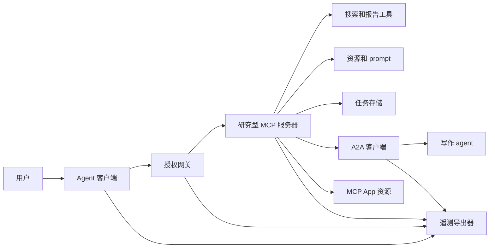
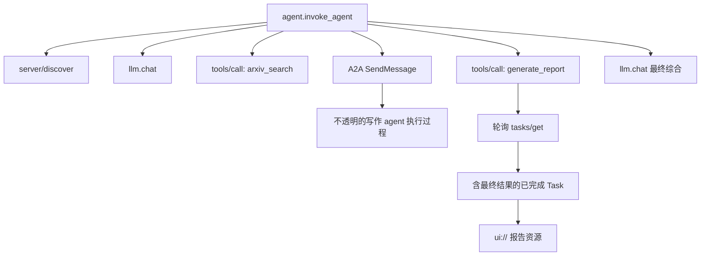
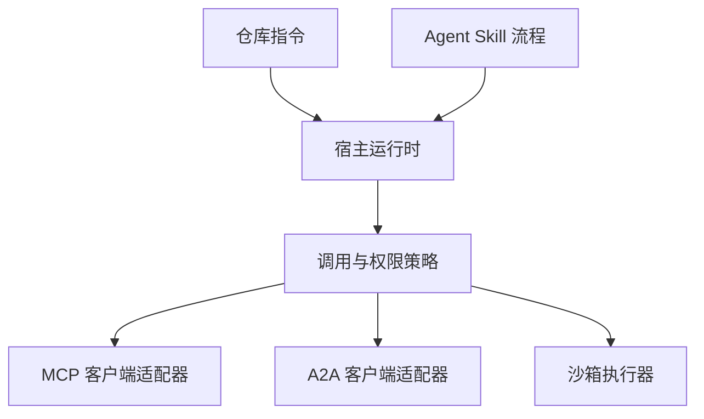

<<<<<<< HEAD
# 综合项目——构建一套完整的工具生态

> 阶段 13 把每个零件都教了。这个综合项目把它们串成一个生产形状的系统：一个带 tools + resources + prompts + tasks + UI 的 MCP server、边缘处的 OAuth 2.1、一个 RBAC 网关、一个多 server client、一次 A2A 子 agent 调用、进入 collector 的 OTel 追踪、CI 里的工具投毒检测，以及一个 AGENTS.md + SKILL.md 包。到最后，你能为每一个架构选择做辩护。

**类型：** Build
**语言：** Python（标准库，端到端生态脚手架）
**前置要求：** 阶段 13 · 01 到 21
**预计时间：** ~120 分钟

## 学习目标

- 组合一个暴露 tools、resources、prompts，以及一个带 `ui://` app 的 task 的 MCP server。
- 用一个强制 RBAC 和钉定哈希的 OAuth 2.1 网关罩住这个 server。
- 写一个端到端用 OTel GenAI 属性追踪的多 server client。
- 把一部分工作负载委派给一个 A2A 子 agent；验证不透明性得以保持。
- 用 AGENTS.md + SKILL.md 把整个栈打包，让其他 agent 能驱动它。

## 问题背景

交付那个"研究并出报告"的系统：

- 用户问："总结 2026 年 arXiv 上关于 agent 协议、引用最多的三篇论文。"
- 系统：经由 MCP 搜 arXiv；经由 A2A 把论文摘要委派给一个专门的写手 agent；聚合结果；把一份交互式报告渲染成一个 MCP Apps `ui://` 资源；把每一步记到 OTel。

阶段 13 的所有基元都登场了。这不是玩具——2026 年 Anthropic（Claude Research 产品）、OpenAI（带 Apps SDK 的 GPT）和第三方交付的生产级研究助手系统，正是这个形状。

## 核心概念

### 架构

```
[user] -> [client] -> [gateway (OAuth 2.1 + RBAC)] -> [research MCP server]
                                                      |
                                                      +- MCP 工具: arxiv_search (纯)
                                                      +- MCP 资源: notes://recent
                                                      +- MCP prompt: /research_topic
                                                      +- MCP 任务: generate_report (长)
                                                      +- MCP Apps UI: ui://report/current
                                                      +- A2A 调用: writer-agent (tasks/send)
                                                      |
                                                      +- OTel GenAI span
```

### trace 层级

```
agent.invoke_agent
 ├── llm.chat (起手)
 ├── mcp.call -> tools/call arxiv_search
 ├── mcp.call -> resources/read notes://recent
 ├── mcp.call -> prompts/get research_topic
 ├── a2a.tasks/send -> writer-agent
 │    └── task 转移 (内部不透明)
 ├── mcp.call -> tools/call generate_report (task 增强)
 │    └── tasks/status 轮询
 │    └── tasks/result (completed, 返回 ui:// 资源)
 └── llm.chat (最终合成)
```

一个 trace id。每个 span 都有正确的 `gen_ai.*` 属性。

### 安全态势

- OAuth 2.1 + PKCE，配把受众钉到网关的 resource indicator。
- 网关持有上游凭证；用户从不见它们。
- RBAC：`alice` 有 `research:read`、`research:write`，能调所有工具。`bob` 有 `research:read`，不能调 `generate_report`。
- 钉定描述清单：丢掉任何工具哈希变了的 server。
- Rule of Two 审计：没有工具同时组合不可信输入、敏感数据和有后果的动作。

### 渲染

最终的 `generate_report` 任务返回内容 block 加一个 `ui://report/current` 资源。client 的宿主（Claude Desktop 等）把交互式仪表盘渲染在一个沙箱 iframe 里。仪表盘含一个排序的论文列表、引用计数，以及一个按钮，对用户点的任意论文调 `host.callTool('summarize_paper', {arxiv_id})`。

### 打包

整个东西作为以下交付：

```
research-system/
  AGENTS.md                     # 项目约定
  skills/
    run-research/
      SKILL.md                  # 顶层工作流
  servers/
    research-mcp/               # MCP server
      pyproject.toml
      src/
  agents/
    writer/                     # A2A agent
  gateway/
    config.yaml                 # RBAC + 钉定清单
```

用户用 `docker compose up` 部署。Claude Code、Cursor、Codex 和 opencode 的用户可以靠触发 `run-research` skill 来驱动这个系统。

### 阶段 13 每一课贡献了什么

| 课 | 综合项目用上的 |
|--------|------------------------|
| 01-05 | 工具接口、provider 可移植性、并行调用、schema、lint |
| 06-10 | MCP 基元、server、client、传输、resources + prompts |
| 11-14 | sampling、roots + elicitation、异步 tasks、`ui://` apps |
| 15-17 | 工具投毒、OAuth 2.1、网关 + 注册表 |
| 18 | A2A 子 agent 委派 |
| 19 | OTel GenAI 追踪 |
| 20 | LLM 层的路由网关 |
| 21 | SKILL.md + AGENTS.md 打包 |

```figure
t3-capstone-chain
```

## 实际使用

`code/main.py` 把前几课的模式缝成一个可运行的 demo。全标准库、全进程内，让你能端到端地读它。它跑研究并出报告场景的完整流程：和网关握手、OAuth 2.1 模拟、tools/list 合并、generate_report 作为一个 task、对 writer 的 A2A 调用、返回 ui:// 资源、发出 OTel span。

要看什么：

- 贯穿每一跳的一个 trace id。
- 网关策略拦住第二个用户写入。
- task 生命周期走 working → completed，并同时返回 text 和 ui:// 内容。
- A2A 调用的内部状态对编排器不透明。
- AGENTS.md 和 SKILL.md 是另一个 agent 重现这个工作流唯一需要的文件。

## 拿去用

本课产出 `outputs/skill-ecosystem-blueprint.md`。给定一个产品需求（研究、摘要、自动化），这个 skill 产出完整架构：用哪些 MCP 基元、哪些网关控制、哪些 A2A 调用、哪些遥测、哪种打包。

## 练习

1. 跑 `code/main.py`。注意那个单一 trace id 以及 span 如何嵌套。数一数 demo 触及了阶段 13 的多少个基元。

2. 扩展 demo：加第二个后端 MCP server（比如 `bibliography`），确认网关把它的工具合并进同一个命名空间。

3. 把假的 A2A 写手 agent 换成一个跑在子进程上的真实的。用第 19 课的脚手架。

4. 在编排器和 LLM 之间，给路由网关加一个 PII 脱敏步骤。确认用户查询里的邮箱被清洗掉。

5. 为一个将要维护这个系统的队友写一个 AGENTS.md。它应该不到五分钟就能读完，并给他们驱动这个综合项目（在 Cursor 或 Codex 里）所需的一切。

## 关键术语

| 术语 | 大家嘴上怎么说 | 它实际是什么 |
|------|----------------|------------------------|
| Capstone | "阶段 13 集成 demo" | 用上每个基元的端到端系统 |
| Research and report | "那个场景" | 搜索、摘要、渲染模式 |
| Ecosystem | "所有零件放一起" | server + client + 网关 + 子 agent + 遥测 + 包 |
| Trace hierarchy | "单一 trace id" | 每跳的 span 共享 trace；父子经由 span id |
| Gateway-issued token | "传递性鉴权" | client 只见网关的 token；网关持有上游凭证 |
| Merged namespace | "所有工具在一个扁平列表里" | 网关处的多 server 合并，冲突时加前缀 |
| Opacity boundary | "A2A 调用隐藏内部" | 子 agent 的推理对编排器不可见 |
| Three-layer stack | "AGENTS.md + SKILL.md + MCP" | 项目上下文 + 工作流 + 工具 |
| Defense-in-depth | "多个安全层" | 钉定哈希、OAuth、RBAC、Rule of Two、审计日志 |
| Spec compliance matrix | "我们交付的对应规范所要求的" | 把交付物映射到 2025-11-25 要求的清单 |

## 延伸阅读

- [MCP — Specification 2025-11-25](https://modelcontextprotocol.io/specification/2025-11-25) — 整合参考
- [MCP blog — 2026 roadmap](https://blog.modelcontextprotocol.io/posts/2026-mcp-roadmap/) — 协议的走向
- [a2a-protocol.org](https://a2a-protocol.org/latest/) — A2A v1.0 参考
- [OpenTelemetry — GenAI semconv](https://opentelemetry.io/docs/specs/semconv/gen-ai/) — 权威追踪约定
- [Anthropic — Claude Agent SDK overview](https://code.claude.com/docs/en/agent-sdk/overview) — 生产 agent 运行时模式
=======
# 综合项目：无状态工具生态

> 生产 agent 系统由一组边界构成，而不是功能的堆砌。本综合项目将易于阅读的进程内模拟，与真实部署仍需要的协议客户端、授权服务器、沙箱和遥测导出器明确分开。

**类型：** Build
**语言：** Python（标准库，进程内模拟）
**前置要求：** 阶段 13 · 第 01 至 22 课，使用 MCP `2026-07-28` 修订版
**预计时间：** 约 120 分钟

## 学习目标

- 将工具调用、任务形态的结果、委派工作、UI 资源、授权策略和追踪记录组合为一条流程。
- 在每个 MCP 请求中携带协议版本、客户端身份和能力，而不是依赖连接会话。
- 在使用前发现 server，并通过官方 Tasks 扩展处理耗时工作。
- 区分协议形态的模拟与 MCP、A2A、OAuth 或 OpenTelemetry 的实际实现。
- 将每个模拟边界映射到生产环境中必须替换它的组件。
- 让 `AGENTS.md`、Agent Skill、运行时适配器、工具和安全策略各司其职。
- 说明哪些结论可由本地输出验证，哪些仍需要实时集成测试。

## 问题背景

设计一个研究与报告系统。用户要求查找有关 agent 协议的论文。系统搜索论文目录、委派摘要任务、生成报告、返回 UI 资源，并记录请求穿过系统的路径。

这句话掩盖了多份彼此独立的契约：

- 面向模型的工具 schema；
- 无状态请求信封与 server 发现契约；
- 针对参与者、scope 和工具身份的网关决策；
- 耗时操作的契约；
- 委派协议；
- host 到 app 的桥接；
- 追踪上下文传播与导出；
- 可复用的操作流程。

`code/main.py` 用普通 Python 函数和字典让这些边界保持可见。它不会打开传输层、联系 arXiv、执行 OAuth、调用 A2A server、渲染 MCP App 或导出遥测数据。因此，你能轻松检查控制流，又不会把模拟说成合规服务。

## 核心概念

### 目标架构



该架构是对公开协议模式的概念性组合，并不声称任何产品的私有内部实现就是如此。

### 目标追踪



在真实实现中，每一跳都会传播追踪上下文。span 名称和属性必须遵循所选 instrumentation 版本支持的 OpenTelemetry 语义约定。仅共享一个 trace 标识符，并不能证明父子关系、导出或后端摄取正确。

### 当前协议接口

请使用当前协议定义的方法名，不要依赖记忆中旧草案的名称：

| 边界 | 当前接口 | 综合项目的模拟方式 |
|---|---|---|
| MCP 发现 | 强制要求的 `server/discover` | 直接函数，返回版本、能力和 server 身份 |
| MCP 请求上下文 | 每个 `params._meta` 中包含版本、能力和客户端身份 | 每次模拟调用都传入新的请求元数据 |
| MCP 工具调用 | `tools/call` | 直接分派 Python 函数 |
| MCP 任务轮询 | `io.modelcontextprotocol/tasks` 搭配 `tasks/get` | 先返回工作中的 handle，再返回携带最终结果的已完成任务 |
| A2A 委派 | gRPC 和 JSON-RPC 中的 `SendMessage`；HTTP+JSON 中的 `POST /message:send` | 一个嵌套 span，没有远程调用或人为延迟 |
| MCP App 调用 server 工具 | `app.callServerTool({ name, arguments })` | 没有实时桥接的 HTML 字符串 |
| OAuth 授权 | 授权 server、受保护资源元数据、audience 和 scope 校验 | 静态 token 查找和 scope 成员关系检查 |
| OpenTelemetry | SDK、propagator、exporter，以及 collector 或后端 | 内存中的 span 字典 |

协议名称只是第一层。生产测试还必须通过真实连线验证序列化、认证失败、取消、超时、重试和版本兼容性。

### 无状态 MCP 改变了集成边界

修订版 `2026-07-28` 移除了协议会话以及 `initialize` / `notifications/initialized` 握手，也移除了 `Mcp-Session-Id`。每个请求都携带以下带命名空间的 `_meta` 字段：

```json
{
  "io.modelcontextprotocol/protocolVersion": "2026-07-28",
  "io.modelcontextprotocol/clientCapabilities": {
    "extensions": {
      "io.modelcontextprotocol/tasks": {}
    }
  },
  "io.modelcontextprotocol/clientInfo": {
    "name": "capstone-client",
    "version": "1.0.0"
  }
}
```

server 必须实现 `server/discover`。普通结果使用 `resultType: "complete"`；任务 handle 使用 `resultType: "task"`。每个结果都应在 `_meta.io.modelcontextprotocol/serverInfo` 中标识该 server。

任务扩展提供 `tasks/get`、`tasks/update` 和 `tasks/cancel`。工具可以先返回 `resultType: "task"`；`tasks/get` 本身返回 `resultType: "complete"`，而完成的 `Task` 包含最终结果。旧的 `tasks/result` 和 `tasks/list` 方法不属于当前扩展。客户端必须在可能收到任务 handle 的同一请求中声明 `io.modelcontextprotocol/tasks`。若未声明，server 返回 `-32021`，其 `requiredCapabilities` 的形状为缺失的客户端能力对象，其中包含 `extensions.io.modelcontextprotocol/tasks`。

### 安全态势

目标部署采用纵深防御：

- 在客户端类型需要时，使用带 PKCE 的 OAuth 授权；
- 对签发的 access token 进行资源和 audience 绑定；
- 由网关 RBAC 检查请求的工具和 scope；
- 上游凭据保存在模型可见上下文之外；
- 使用钉定或经审查的工具描述 manifest；
- 针对不可信输入、敏感数据和后果性操作执行 Rule of Two 审查；
- 使用在 skill 外部强制实施文件系统、进程、网络、凭据和资源限制的执行沙箱。

本 demo 只实现了静态 token、scope 检查和描述哈希。它适合验证策略流程，不适合验证安全性。

### Skill 是流程，不是传输层

Agent Skill 可以告诉运行时如何完成研究流程、应预期哪些工具契约、应保存哪些证据以及何时停止。它不能让 MCP server 凭空存在、建立 A2A 兼容性、授予 scope 或创建沙箱。



当流程引用伴随文件时，应交付完整的 skill 目录。这个较早综合项目中的扁平产物只是课程蓝图，并不能证明 host 会保留可移植 bundle。第 24 至 27 课会构建并测试完整 bundle 的生命周期。

### 课程产物元数据是本地适配器

课程目录和安装器识别名为 `skill-*.md` 的扁平文件，但这是仓库约定，不是可移植 Agent Skills 包的契约。它们的极简 frontmatter 解析器只读取顶层键。因此，本课将可移植身份字段与课程目录字段置于同一层：

```yaml
---
name: ecosystem-blueprint
description: Produce a full Phase 13 ecosystem architecture for a product need.
version: "1.0.0"
phase: "13"
lesson: "23"
tags: [mcp, capstone, ecosystem, architecture, a2a, otel]
---
```

`name` 和 `description` 是可移植身份字段。`version`、`phase`、`lesson` 和 `tags` 是课程目录专用的扩展字段。课程解析器要求 `tags` 使用行内列表，以便 `--tag capstone` 能匹配它。

可移植目录 skill 可以在可选的 `metadata` map 中保存字符串值的扩展数据。但这不意味着 `metadata` 可以与本仓库的目录 schema 互换。如果这个扁平文件将 `version` 或 `tags` 嵌套到 `metadata` 下，极简解析器会跳过那些缩进键，目录会记录空版本，按标签筛选也找不到该产物。生产 host 应使用安全的 YAML 解析器，并验证自身文档规定的 schema。

### 模拟与生产的对照

| 层 | `code/main.py` | 生产替代项 | 所需证据 |
|---|---|---|---|
| 发现 | `server_discover()` 加静态 `TOOLS` | `server/discover`，随后进行带缓存意识的 `tools/list` | 连线记录、确定性顺序和 schema 验证 |
| 认证 | 以 token 为键的字典 | OAuth 授权和资源 server 校验 | issuer、audience、scope、过期和失败测试 |
| 授权 | scope 成员关系 | 绑定参与者、工具、目标和租户的网关策略 | 允许和拒绝的审计用例 |
| 搜索 | 静态论文 fixture | Search API 或 MCP server | 来源溯源、排序和错误测试 |
| 任务 | 本地 handle 加即时 `tasks/get` | 带 `tasks/get`、`tasks/update`、`tasks/cancel` 和 TTL 的持久 `io.modelcontextprotocol/tasks` 存储 | 状态转换、输入、取消和恢复测试 |
| 委派 | sleep 加嵌套 span | A2A 客户端和远程 Agent Card | 契约、超时、重试和不透明性测试 |
| App | HTML 字符串和 URI | MCP Apps 资源与 `App` 桥接 | CSP、权限、工具调用和浏览器测试 |
| 遥测 | 内存列表 | OTel SDK 和 exporter | collector 接收与 trace-parent 断言 |
| 沙箱 | 无 | host 强制实施的隔离执行器 | 逃逸、出站连接、secret 和资源限制测试 |

这张表是交接边界。本地运行变绿只验证模拟本身。

### 阶段 13 对照表

| 课程 | 贡献 |
|---|---|
| 01-05 | 工具接口、调用、schema、结构化结果和确定性验证 |
| 06-14 | 无状态 MCP 请求信封、发现、传输、资源、prompt、扩展和 Apps |
| 15-18 | 投毒防御、OAuth、网关、注册表和生产认证 |
| 19 | A2A 消息与任务委派 |
| 20 | OpenTelemetry GenAI 追踪设计 |
| 21 | 模型 provider 路由 |
| 22 | 可移植 skill 契约与运行时边界 |

```figure
t3-capstone-chain
```

## 动手构建

运行进程内 harness：

```bash
cd phases/13-tools-and-protocols/23-capstone-tool-ecosystem
python3 code/main.py
```

检查以下六点：

1. `server/discover` 宣告修订版 `2026-07-28` 和 Tasks 扩展。
2. Alice 可以读取和生成报告，而 Bob 的写入 scope 调用会被拒绝。
3. 一次编排器运行中的每个本地 span 共享同一个 trace 标识符，并记录父 span 标识符。
4. 报告开始时是任务 handle。`tasks/get` 返回已完成任务，其最终结果包含文本和 `ui://` 引用。
5. 被委派的 writer 保持不透明，因为编排器只记录边界 span。
6. 没有任何输出声称发生了网络连接、OAuth 交换、collector 导出、浏览器渲染或沙箱执行。

脚本会运行两次，因此会产生两个根 trace。审计条目仅存在于进程内，并会在下一次运行时重置。

## 实际使用

一次只提升一层：

1. 用真实的 `server/discover` 和 `tools/list` 调用替换 `server_discover()` 与静态工具列表。每个请求都发送版本、身份和能力。
2. 用授权 server 和受保护资源校验替换静态 token。
3. 实现 `io.modelcontextprotocol/tasks` 扩展，并测试 `tasks/get`、`tasks/update`、`tasks/cancel`、超时、TTL 和重启恢复。不要添加 `tasks/result` 或 `tasks/list`。
4. 用可解析 Agent Card 并发送消息的 A2A 客户端替换委派 stub。
5. 使用官方 SDK 构建 App，并通过 `app.callServerTool` 调用 server 工具。
6. 将 span 导出至测试 collector，并在接收端断言父子关系。
7. 在第 26 课的沙箱契约中运行工具和脚本执行。
8. 将流程打包成完整目录 bundle，并通过第 27 课的发布门槛。

每次提升都需要一项跨越新边界的集成测试。连线成为真实实现后，也不要删除底层策略测试。

## 拿去用

本课产出 `outputs/skill-ecosystem-blueprint.md`，这是一个旧式单文件课程产物。它要求一份一页架构，覆盖基础构件、安全性、委派、遥测、打包方式及最棘手的运维风险。其顶层目录字段会由仓库真实的目录和安装器解析器处理。

因为它不是目录 bundle，不能携带引用、脚本、资产或评测 fixture。若要在本课程之外发布可复用 skill，请使用第 22 和第 24 至 27 课提供的包格式。

## 练习

1. 运行 `code/main.py`。区分哪些事实由输出证明，哪些生产结论仍需集成证据。
2. 添加第二个静态后端，并为两个同名工具定义冲突规则。然后将两个列表都替换成真实的 `tools/list` 调用。
3. 用 A2A 测试 server 替换 writer stub。记录 Agent Card、消息请求、超时路径和返回的产物。
4. 添加一个可在进程重启后存活的任务存储。证明客户端可使用 `tasks/get` 恢复、遵守 `pollIntervalMs`，并在不使用 `tasks/result` 的前提下读取已完成任务的最终结果。
5. 构建一个最小 MCP App，在浏览器中以严格的 CSP 和显式权限验证 `app.callServerTool`。
6. 通过 OTel SDK 将模拟 span 导出到本地 collector。断言接收情况、trace 标识符、父子关系和错误状态。
7. 为仓库级维护规则编写 `AGENTS.md`，并为可复用的研究流程编写单独的 skill bundle。解释为什么这两个文件都不会授予工具权限。

## 关键术语

| 术语 | 常见说法 | 实际含义 |
|---|---|---|
| 综合项目 | “所有东西都接起来了” | 一种分阶段集成，其模拟与实时边界仍保持明确 |
| 协议形态的模拟 | “它基本上就是 MCP” | 类似协议但未实现其连线契约的本地数据和调用 |
| Tasks 扩展 | “耗时的工具调用” | 可选的 `io.modelcontextprotocol/tasks` 生命周期，包含持久身份、轮询、客户端输入、最终结果和取消语义 |
| 不透明边界 | “另一个 agent 会处理它” | 调用方只看到声明的接口和产物，看不到私有推理或内部状态 |
| 运行时适配器 | “skill 集成” | 将可移植流程映射至发现、调用、工具、策略和上下文的 host 代码 |
| 集成证据 | “它通过了” | 证明真实边界被跨越的记录、产物或接收端观察 |

## 延伸阅读

- [MCP specification 2026-07-28](https://modelcontextprotocol.io/specification/2026-07-28)：无状态请求、发现、工具、授权和传输行为。
- [MCP 2026-07-28 key changes](https://modelcontextprotocol.io/specification/2026-07-28/changelog)：会话移除、每请求元数据、MRTR、扩展与弃用项。
- [MCP Tasks extension](https://tasks.extensions.modelcontextprotocol.io/specification/draft/tasks)：`tasks/get`、`tasks/update`、`tasks/cancel`，以及终止任务携带的最终结果。
- [MCP Apps SDK](https://github.com/modelcontextprotocol/ext-apps/blob/main/docs/overview.md)：`App` 和 `app.callServerTool`。
- [A2A protocol](https://a2a-protocol.org/latest/)：Agent Card、消息投递、任务、产物和传输绑定。
- [OpenTelemetry GenAI semantic conventions](https://opentelemetry.io/docs/specs/semconv/gen-ai/)：追踪和属性约定。
- [Agent Skills specification](https://agentskills.io/specification)：流程层使用的可移植包契约。
>>>>>>> main
