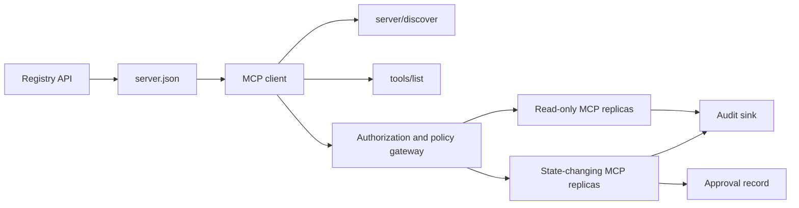

<<<<<<< HEAD
# 顶点项目 13 —— 带注册中心和治理的 MCP 服务器

> Model Context Protocol 不再是未来，在 2026 年成了默认的工具使用规范。Anthropic、OpenAI、Google，以及每个主流 IDE 都出了 MCP 客户端。Pinterest 公开了它内部的 MCP 服务器生态。AAIF Registry 在 `.well-known` 处把能力元数据规范化了。AWS ECS 发布了参考级的无状态部署。Block 的 goose-agent 把同一套协议塞进了一个托管助手里。2026 年的生产形态是：StreamableHTTP 传输、OAuth 2.1 scope、OPA 策略把关，以及一个让平台团队发现、校验、启用服务器的注册中心。把它端到端做出来。

**类型：** Capstone
**语言：** Python（服务器，经由 FastMCP）或 TypeScript（@modelcontextprotocol/sdk），Go（注册中心服务）
**前置要求：** 第 11 阶段（LLM 工程）、第 13 阶段（工具与 MCP）、第 14 阶段（agent）、第 17 阶段（基础设施）、第 18 阶段（安全）
**涉及阶段：** P11 · P13 · P14 · P17 · P18
**预计时间：** 25 小时

## 问题背景

MCP 成了工具使用的通用语。Claude Code、Cursor 3、Amp、OpenCode、Gemini CLI，以及每个托管 agent 现在都消费 MCP 服务器。生产上的挑战不在编写服务器（FastMCP 让这事很简单），而在带企业要求大规模部署它们：逐租户的 OAuth scope、破坏性工具上的 OPA 策略、StreamableHTTP 无状态扩展、一个用于发现的注册中心、逐工具调用的审计日志。Pinterest 内部的 MCP 生态和 AAIF Registry 规范立下了 2026 年的标准。

你将做一个暴露 10 个内部工具（Postgres 只读、S3 列举、Jira、Linear、Datadog 等）的 MCP 服务器、一个供平台发现的注册中心 UI，以及破坏性工具的人类审批闸门。负载测试演示 StreamableHTTP 的水平扩展。审计轨迹满足一次企业安全评审。

## 核心概念

MCP 2026 修订版强制把 StreamableHTTP 作为默认传输。不像早先的 stdio-加-SSE 形态，StreamableHTTP 默认无状态：单个 HTTP 端点接收 JSON-RPC 请求、流式回响应，并支持给通知用的长连接。无状态意味着能在负载均衡器后面水平扩展。

授权是带逐工具 scope 的 OAuth 2.1。一个 token 携带 `jira:read`、`s3:list`、`postgres:query:readonly` 这类 scope。MCP 服务器在工具调用时检查 scope，而不只是在会话开始时。对高风险工具，服务器拒绝任何 scope 未在最近 N 分钟内被提升到 `approved:by:human` 的调用——那次提升来自一张 Slack 评审卡片。

注册中心是一个独立服务。每个 MCP 服务器在 `.well-known/mcp-capabilities` 处暴露一份文档，带它的工具清单、传输 URL、鉴权要求。注册中心轮询、校验并建索引。平台团队用注册中心 UI 看有哪些工具可用、它们需要什么 scope、哪些团队拥有它们。

## 架构

```
MCP client (Claude Code, Cursor 3, ...)
          |
          v
StreamableHTTP over HTTPS (JSON-RPC + streaming)
          |
          v
MCP server (FastMCP) behind load balancer
          |
   +------+------+---------+----------+------------+
   v             v         v          v            v
Postgres    S3 listing  Jira       Linear     Datadog
(read-only) (paged)     (read)     (read)     (query)
          |
   +------+-------------+
   v                    v
 OPA policy gate   destructive tool MCP (separate server)
                        |
                        v
                   human approval via Slack
                        |
                        v
                   audit log (append-only, per-tenant)

  registry service
     |
     v  GET /.well-known/mcp-capabilities from each server
     v
     UI: search / validate / enable-disable / ownership
```

## 技术栈

- 服务器框架：FastMCP（Python）或 `@modelcontextprotocol/sdk`（TypeScript）
- 传输：StreamableHTTP over HTTPS（无状态）
- 鉴权：OAuth 2.1，工作负载身份经由 SPIFFE / SPIRE
- 策略：逐工具的 OPA / Rego 规则；每请求一个策略决策服务
- 注册中心：自托管，消费 `.well-known/mcp-capabilities` 清单
- 人类审批：破坏性工具用 Slack 交互式消息
- 部署：AWS ECS Fargate 或 Fly.io，每租户一个服务器，或共享并带租户圈定
- 审计：逐租户桶的结构化 JSONL，带逐调用血缘

```figure
cf-mcp-gate
```

## 动手构建

1. **工具面。** 暴露 10 个内部工具：Postgres 只读查询、S3 列对象、Jira 搜索/取、Linear 搜索/取、Datadog 指标查询、PagerDuty 值班查询、GitHub 只读、Notion 搜索、Slack 搜索、Salesforce 读。每个工具有一个带类型的 schema 和一个 scope 标签。

2. **FastMCP 服务器。** 挂上工具。配置 StreamableHTTP 传输。加一个做 OAuth token 内省和 scope 强制的中间件。

3. **OPA 策略。** 逐工具的 Rego 策略：什么 scope 允许调用、应用什么 PII 脱敏、应用什么 payload 大小上限。每个工具调用都调决策服务。

4. **注册中心服务。** 一个独立的 Go 或 TS 服务，从已注册的服务器轮询 `.well-known/mcp-capabilities`、用 JSON Schema 校验，并暴露一个 列举 / 搜索 / 校验 / 启用-停用 的 UI。

5. **能力清单。** 每个服务器暴露 `.well-known/mcp-capabilities`，带：工具列表、鉴权要求、传输 URL、所有者团队、SLO。

6. **破坏性工具分离。** 改变状态的工具（Jira 创建、Linear 创建、Postgres 写）住在第二个 MCP 服务器上，带更严的鉴权流：token 必须带一个在 15 分钟内经 Slack 卡片提升的 `approved:by:human` scope。

7. **审计日志。** 逐租户的仅追加 JSONL：`{timestamp, user, tool, args_redacted, response_redacted, outcome}`。写之前用 Presidio 做 PII 脱敏。

8. **负载测试。** StreamableHTTP 上 100 个并发客户端。通过加第二个副本演示水平扩展；展示负载均衡器在无会话粘性的情况下重新分配。

9. **一致性测试。** 对两个服务器跑官方 MCP 一致性套件。通过所有强制章节。

## 实际使用

```
$ curl -H "Authorization: Bearer eyJhbGc..." \
       -X POST https://mcp.internal.example.com/ \
       -d '{"jsonrpc":"2.0","method":"tools/call",
            "params":{"name":"postgres.readonly","arguments":{"sql":"SELECT 1"}}}'
[registry]   capability validated: postgres.readonly v1.2
[policy]    scope postgres:query:readonly present; allowed
[audit]     logged: user=u42 tool=postgres.readonly outcome=ok
response:    { "result": { "rows": [[1]] } }
```

## 拿去用

`outputs/skill-mcp-server.md` 描述交付物。一个生产级的 MCP 服务器 + 注册中心 + 审计层，给内部工具用，带 OAuth 2.1 scope 和 OPA 把关。

| 权重 | 标准 | 怎么衡量 |
|:-:|---|---|
| 25 | 规范一致性 | StreamableHTTP + 能力清单通过 MCP 一致性测试 |
| 20 | 安全性 | scope 强制、OPA 覆盖每个工具、密钥卫生 |
| 20 | 可观测性 | 带 PII 脱敏的逐工具调用审计日志 |
| 20 | 规模 | 100 客户端负载测试的水平扩展演示 |
| 15 | 注册中心体验 | 发现 / 校验 / 启用-停用 工作流 |
| **100** | | |

## 练习

1. 加一个新工具（Confluence 搜索）。让它过注册中心校验流上线，而不碰核心服务器。

2. 写一个 OPA 策略，脱敏 Postgres 查询结果里名为 `email`、`ssn`、`phone` 的列。用一个探针查询演练。

3. 在本地延迟上给 StreamableHTTP vs stdio 跑基准。报告逐调用 p50/p95。

4. 实现逐租户配额：每租户每工具每分钟最多 N 次调用。用第二条 OPA 规则强制。

5. 跑 [mcp-conformance-tests](https://github.com/modelcontextprotocol/conformance) 里的 MCP 一致性套件，修掉每个失败。

## 关键术语

| 术语 | 大家嘴上怎么说 | 它实际是什么 |
|------|-----------------|------------------------|
| StreamableHTTP | “2026 MCP 传输” | 无状态 HTTP + 流式；为网络化服务器取代 SSE + stdio |
| Capability manifest（能力清单） | “well-known 文档” | `.well-known/mcp-capabilities`，带工具列表、鉴权、传输 URL |
| OPA / Rego | “策略引擎” | Open Policy Agent，对照外部规则授权工具调用 |
| Scope elevation（scope 提升） | “经人类批准” | 经 Slack 审批授予的短时 scope，破坏性工具必需 |
| Registry（注册中心） | “工具发现” | 从能力清单给 MCP 服务器建索引的服务 |
| Workload identity（工作负载身份） | “SPIFFE / SPIRE” | 给 OAuth token 签发用的加密服务身份 |
| Conformance suite（一致性套件） | “规范测试” | 官方 MCP 测试套，查 StreamableHTTP + 工具清单正确性 |

## 延伸阅读

- [Model Context Protocol 2026 Roadmap](https://blog.modelcontextprotocol.io/posts/2026-mcp-roadmap/) —— StreamableHTTP、能力元数据、注册中心
- [AAIF MCP Registry spec](https://github.com/modelcontextprotocol/registry) —— 2026 注册中心规范
- [AWS ECS reference deployment](https://aws.amazon.com/blogs/containers/deploying-model-context-protocol-mcp-servers-on-amazon-ecs/) —— 参考级生产部署
- [Pinterest internal MCP ecosystem](https://www.infoq.com/news/2026/04/pinterest-mcp-ecosystem/) —— 参考级内部部署
- [Block `goose` MCP usage](https://block.github.io/goose/) —— 参考级 agent 消费模式
- [FastMCP](https://github.com/jlowin/fastmcp) —— Python 服务器框架
- [Open Policy Agent](https://www.openpolicyagent.org/) —— 策略引擎参考
- [SPIFFE / SPIRE](https://spiffe.io) —— 工作负载身份参考
=======
# 顶点项目 13：带 Registry 和治理的无状态 MCP 服务器

> 生产级 MCP 不是一个服务器进程，而是一串契约：可发布的元数据、实时发现、无状态请求信封、授权、策略、审计和部署证据。

**类型：** 顶点项目
**语言：** Python 和 TypeScript 参考模型；任意生产语言
**前置要求：** 第 11、13、14、17 和 18 阶段
**必修 MCP 深入课程：** [第 28 课：工具契约](../../../13-tools-and-protocols/28-mcp-tool-contracts-and-content/docs/zh.md)、[第 29 课：可靠性](../../../13-tools-and-protocols/29-mcp-reliability-cancellation-and-flow-control/docs/zh.md)、[第 30 课：Registry 供应链](../../../13-tools-and-protocols/30-mcp-registry-supply-chain-and-drift/docs/zh.md) 和 [第 31 课：一致性运维](../../../13-tools-and-protocols/31-mcp-conformance-versioning-and-operations/docs/zh.md)
**协议目标：** MCP `2026-07-28`
**预计时间：** 约 25 小时

## 学习目标

- 实现无状态的 MCP 请求与结果信封。
- 将 Registry 元数据与实时协议发现分离。
- 构建确定性、具备缓存意识的工具发现。
- 对每一次工具调用强制执行 issuer、audience、scope 和审批策略。
- 在没有 session affinity 的前提下部署 Streamable HTTP。
- 在 wire、授权、策略、Registry 和审计边界证明行为正确。

## 必修 MCP 前置学习路径

在将本顶点项目视作生产就绪之前，请按顺序完成链接的四节第 13 阶段课程：

1. [第 28 课](../../../13-tools-and-protocols/28-mcp-tool-contracts-and-content/docs/zh.md) 定义本服务器必须暴露的工具、schema、内容、分页、完成、路由和错误契约。
2. [第 29 课](../../../13-tools-and-protocols/29-mcp-reliability-cancellation-and-flow-control/docs/zh.md) 定义取消竞争、截止时间、幂等性、背压、重试和重连行为。
3. [第 30 课](../../../13-tools-and-protocols/30-mcp-registry-supply-chain-and-drift/docs/zh.md) 定义命名空间、溯源、准入 pin、Registry 状态、漂移、账本和回滚证据。
4. [第 31 课](../../../13-tools-and-protocols/31-mcp-conformance-versioning-and-operations/docs/zh.md) 定义 golden 与负向 transcript、严格版本时期、SDK 差异检查、代理证明、脱敏、健康检查和发布门禁。

本顶点项目整合这些产物，不会用一次 happy-path SDK 测试替代它们。

## 问题背景

一个内部平台需要只读数据工具，以及少量会改变状态的工具。开发者必须能发现服务器、理解如何连接、检查它的实时能力，并且只能调用自己有权使用的操作。

难点不在于注册一个函数，而在于让六种不同的事实保持一致：

1. `server.json` 说明服务器可以在何处安装或访问。
2. `server/discover` 说明实时进程当前支持什么。
3. 每个请求说明它使用哪个协议版本和 client capabilities。
4. 授权将调用者绑定到正确的 issuer、resource 和 scopes。
5. 策略决定这个具体动作能否执行。
6. 审计证据记录穿过边界的内容，同时不泄露 secrets 或敏感 payload。

其中任一环发生漂移，平台就可能列出无法访问的服务器、将不兼容的 client 路由过去、接受为另一个 resource 签发的 token，或者在预期审查缺失时暴露破坏性操作。

## 两层发现

Registry 与实时 MCP 服务器回答的是不同问题。

| 层 | 契约 | 回答的问题 |
|---|---|---|
| 发布 | `server.json` 和 Registry API | 这是什么服务器，它的包或远程 endpoint 在哪里，以及如何配置？ |
| 运行时 | `server/discover` | 这个进程支持哪些协议版本、capabilities、扩展和服务器身份？ |

官方 Registry 使用有版本的 `server.json` schema。远程条目可以命名一个 Streamable HTTP URL：

```json
{
  "$schema": "https://static.modelcontextprotocol.io/schemas/2025-12-11/server.schema.json",
  "name": "com.example/internal-readonly",
  "title": "Internal Read-Only Tools",
  "description": "Read-only incident and data lookup tools.",
  "version": "1.0.0",
  "remotes": [
    {
      "type": "streamable-http",
      "url": "https://mcp.internal.example.com/readonly"
    }
  ]
}
```

Registry schema 版本与 MCP 协议版本彼此独立。不要将其中一个日期改写为与另一个一致。请按各自的契约验证每份文档。

schema 有效不等于证明拥有命名空间。为 `example.com` 验证过的发布者使用反向 DNS 命名空间 `com.example/*` 或它的子命名空间。Registry 授权流程证明这种所有权。按通常顺序保留域名标签会指向另一个命名空间。

stdlib 模型的 `validate_registry_document` 函数有意只是部分远程 profile 校验器。它检查官方要求的 `name`、`description` 和 `version` 字段；可选的 `title`；发布名称与长度限制；具体版本形态；以及每个 `streamable-http` 或 `sse` remote 的 HTTP(S) URL 形态。它还要求非空的 `remotes` 列表，因为本顶点项目始终 live-probe 一个 remote。 `validate_publisher_namespace` 单独检查名称是否符合经验证发布者域名，`validate_runtime_alignment` 则对比发布名称和版本与实时 `serverInfo`。官方 schema 还支持仅 package 的记录和更多 remote 字段。发布前，请使用 pinned 的官方 JSON Schema 或 `mcp-publisher` 验证完整文档；不要将这个无依赖子集说成完整 schema 校验。

服务器必须实现 `server/discover`；client 可以在其他 method 之前调用它。本顶点项目的 client 会在解析 endpoint 后调用，并接收当前协议版本和实时 capabilities：

```json
{
  "resultType": "complete",
  "supportedVersions": ["2026-07-28"],
  "capabilities": {
    "tools": {
      "listChanged": false
    }
  },
  "_meta": {
    "io.modelcontextprotocol/serverInfo": {
      "name": "com.example/internal-readonly",
      "version": "1.0.0"
    }
  },
  "ttlMs": 3600000,
  "cacheScope": "public"
}
```

私有目录可以索引额外的所有权、审查或生命周期数据，但不能把那些数据虚构成 MCP wire 字段或根级 `server.json` 字段。将组织策略放在发布记录旁边。必须公开自定义元数据时，请使用 Registry 的 `_meta.io.modelcontextprotocol.registry/publisher-provided` 扩展，并保持在 4 KB 限制内。

## 无状态 MCP 核心

MCP `2026-07-28` 修订版移除了协议 session 以及 `initialize` / `notifications/initialized` 握手，也移除了 `Mcp-Session-Id`。

每个请求都在 `params._meta` 中携带协议上下文：

```json
{
  "io.modelcontextprotocol/protocolVersion": "2026-07-28",
  "io.modelcontextprotocol/clientCapabilities": {},
  "io.modelcontextprotocol/clientInfo": {
    "name": "internal-platform-client",
    "version": "1.0.0"
  }
}
```

版本和 capabilities 是请求事实，不是连接事实。负载均衡器可以将连续请求发送到不同的健康副本，因为任一副本都能从消息本身验证请求。

普通结果包含 `resultType: "complete"`。服务器应在每个结果的 `_meta.io.modelcontextprotocol/serverInfo` 中放入自身身份。协议版本缺失或不是字符串属于无效 params `-32602`。错误 `-32022` 只用于已提供但不受支持的字符串，其 data 必须严格是 `{"supported": ["2026-07-28"], "requested": "..."}`。

### 可缓存的发现

对于相同的有效工具集，`tools/list` 必须是确定性的。结果包括：

- `ttlMs`，给 client 的新鲜度提示；
- `cacheScope`，取值为 `public` 或 `private`；
- 稳定的工具顺序，使相同列表可以复用 prompt cache；
- `resultType: "complete"` 和服务器身份元数据。

按用户区分的授权通常应产生 `cacheScope: "private"`。不要把按用户变化的工具可见性置于共享公共缓存之后。

## Streamable HTTP

网络服务器暴露一个接受 POST 的 MCP endpoint。每个 JSON-RPC 请求或通知各自使用一个 POST。

对于请求，服务器返回一个 JSON 对象，或仅限该请求范围的 SSE 流。长生命周期的 `subscriptions/listen` 请求承载已选择加入的变更通知。当前 transport 没有独立 GET 流、session DELETE、session header，也没有 `Last-Event-ID` replay。

每个请求包括：

- `MCP-Protocol-Version`，与 body 元数据一致；
- `Mcp-Method`，与 JSON-RPC method 一致；
- `Mcp-Name`，用于 `tools/call`、`resources/read` 和 `prompts/get`；
- `Accept: application/json, text/event-stream`。

请用指定的 `-32020` 错误拒绝不一致的镜像 headers。校验 `Origin`，将本地开发服务器绑定到 loopback，为远程 clients 授权，并把已关闭的请求范围 SSE 响应视为取消。



```figure
cf-mcp-gate
```

## 授权和策略

传输元数据不是授权。每次调用都要验证授权。

对于远程服务器：

1. 发现受保护 resource 元数据。
2. 为该 resource 选择授权服务器。
3. 优先用 Client ID Metadata Documents 完成 client 注册。将 Dynamic Client Registration 视为兼容性支持。
4. 在授权期间发送 resource indicator。
5. 验证返回的 `iss` 值是否与此流程记录的授权服务器一致。
6. 按 issuer 为 client credentials 建键。绝不能跨 issuers 重用注册数据。
7. 在 MCP 服务器验证 token issuer、audience 或 resource、expiry 和 scopes。
8. 对具体工具及其 arguments 应用第二次策略决策。

`readOnlyHint`、`destructiveHint` 等工具注释能帮助 clients 展示风险，但不是可信的授权控制。

### 审批是一条记录，而不是神奇的 scope

会改变状态的调用需要一条审批记录，绑定 actor、工具、规范化 arguments 或 digest、目标环境、expiry，以及一次性或可重复使用策略。单独一条聊天消息不是审批证明。

Python 模型对带排序 key 的规范 JSON 做 hash，然后将该 digest 与 token subject、工具名、服务器 URL 和 expiry 绑定。即使只改一个 argument，重放该记录也会在 handler 执行前失败。审批是独立证据，不是加入 access token 的 scope。

当这能实质降低 blast radius 时，请把高风险工具放在可以独立审查的 surface 上。只有 credentials、策略、部署身份和审计控制也彼此独立时，这种分离才有价值。

## 动手构建

### 1. 建模发布元数据

创建并以 schema 验证 `server.json`。在发布者已认证的命名空间中包含一个稳定名称，以及 version、description、适用时的官方 `repository` 或 `packages` 元数据，以及 remote 或 stdio transport。将 secrets 作为声明的环境变量输入，绝不写入字面值。

### 2. 实现实时发现

在任何功能 RPC 之前实现 `server/discover`。声明支持的协议版本、capabilities、扩展和服务器身份。加入使用 `-32022` 的版本拒绝场景。

### 3. 实现无状态信封

在每个请求中要求协议版本和 client capabilities。在每个结果中返回 `resultType` 和服务器身份。移除初始化状态、连接范围的 capability caches 与 session identifiers。

### 4. 构建工具 surface

从两个只读工具和一个会改变状态的工具开始。为每个工具提供有界 JSON Schema、准确说明、确定的结果形态和诚实的注释。若 clients 依赖结构化结果，则加入输出 schemas。

### 5. 加入具备缓存意识的列表

按稳定顺序返回工具，并带上 `ttlMs` 和 `cacheScope`。分别演练 cache expiry 和列表变更通知行为。

### 6. 加入授权和策略

验证 issuer、audience、expiry 和 scope。每次工具调用都运行策略决策。将审批绑定到精确的高风险动作。在执行 handler 之前拒绝缺失或过期的审批。

### 7. 分离 Registry 与运行时验证

验证静态 `server.json` 记录，然后通过 `server/discover` probe remote endpoint。当发布的 remote、identity、version 或必需 capabilities 与实时进程不一致时报告漂移。

### 8. 加入审计证据

记录 actor、issuer、resource、工具、策略决策、请求标识符、trace context、latency 和 outcome。持久化前脱敏或摘要化敏感 arguments 和结果。将 audit sink 保持在模型可见 context 之外。

### 9. 演练水平扩展

在负载均衡器后放置两个无状态副本。发送至少 100 个并发请求。证明正确性不依赖 affinity。若某个工具需要跨调用状态，请铸造明确的 opaque handle 并将其存入共享持久系统。

### 10. 跨越真实 wire

针对真实服务器 binary 运行一致性检查。捕获请求 headers 和 JSON bodies，而非只检查 SDK objects。演练错误版本、header 不匹配、缺失 scope、错误 audience、畸形 arguments、handler failure、取消和 cache expiry。

## 必需证据包

提交在包含以下五类证据前均不完整：

| 证据 | 最低证明 | 来源课程 |
|---|---|---|
| Wire | golden 和负向场景的脱敏原始 headers 与 JSON-RPC bodies，包括 metadata 类型失败、header 不匹配、不支持版本、缺失或未知 `resultType`、通知无响应以及响应 ID 匹配 | [第 31 课](../../../13-tools-and-protocols/31-mcp-conformance-versioning-and-operations/docs/zh.md) |
| 代理 | 同一稳定场景直接运行，并经部署的中介运行，附 ingress、origin 和 egress status 与 body digests；证明协议错误没有被折叠成通用 500 响应，且 streaming 未被缓冲 | [第 29 课](../../../13-tools-and-protocols/29-mcp-reliability-cancellation-and-flow-control/docs/zh.md) 和 [第 31 课](../../../13-tools-and-protocols/31-mcp-conformance-versioning-and-operations/docs/zh.md) |
| 准入 | 经验证的发布者命名空间、不可变 Registry 记录 digest、artifact 或 remote provenance、实时 `server/discover` identity 与 capability observation、descriptor pin、当前 Registry status 和 admission-ledger event | [第 30 课](../../../13-tools-and-protocols/30-mcp-registry-supply-chain-and-drift/docs/zh.md) |
| 重试 | 取消与完成的竞争、明确 timeout、安全的 read retry、mutation idempotency key、重连后的重新获取，以及证明请求取消不会静默变成持久任务取消 | [第 29 课](../../../13-tools-and-protocols/29-mcp-reliability-cancellation-and-flow-control/docs/zh.md) |
| 回滚 | 精确的前一版本、admission 与 artifact digests、descriptor pin、活跃 Registry status、当前健康窗口、路由恢复结果和脱敏决策证据 | [第 30 课](../../../13-tools-and-protocols/30-mcp-registry-supply-chain-and-drift/docs/zh.md) 和 [第 31 课](../../../13-tools-and-protocols/31-mcp-conformance-versioning-and-operations/docs/zh.md) |

将脱敏证据包的 digest 与 release 一起存储。若缺少任何一类，请阻止发布。不要从进程内 dispatcher 推断代理行为、从 Registry 存在推断准入、从新的 JSON-RPC id 推断重试安全，或从“上一个部署版本”推断回滚就绪。

## 本地参考模型

Python 模型演示 Registry 元数据、反向 DNS 发布者命名空间校验、发布到运行时身份检查、实时发现、确定性工具列表、逐请求元数据、可信 issuer、audience、expiry 和 scope 检查、动作绑定的审批、文档化的部分 Registry 校验器、策略和审计，但不打开网络 socket：

```bash
cd phases/19-capstone-projects/13-mcp-server-with-registry
python3 code/main.py
python3 -m unittest discover -s code/tests -v
```

TypeScript 项目通过 stdio 暴露无状态 JSON-RPC 形态，不使用 MCP SDK。其 `tools/call` 路径强制执行 `tools/list` 所声明的同一套有界输入 schemas；已知工具的无效 arguments 会返回 `isError: true` 的完整结果，而不会调用 executor：

```bash
cd phases/19-capstone-projects/13-mcp-server-with-registry/code/ts
npm install
npm run typecheck
npm test
npm run demo
```

这些模型证明的是本地契约逻辑。它们不能证明 HTTP headers、OAuth exchange、Registry 发布、OPA 集成、负载均衡或 collector receipt。

## Wire 示例

```http
POST /mcp HTTP/1.1
Host: mcp.internal.example.com
Content-Type: application/json
Accept: application/json, text/event-stream
MCP-Protocol-Version: 2026-07-28
Mcp-Method: tools/call
Mcp-Name: postgres.readonly
Authorization: Bearer REDACTED

{
  "jsonrpc": "2.0",
  "id": 42,
  "method": "tools/call",
  "params": {
    "name": "postgres.readonly",
    "arguments": {"sql": "SELECT 1"},
    "_meta": {
      "io.modelcontextprotocol/protocolVersion": "2026-07-28",
      "io.modelcontextprotocol/clientCapabilities": {},
      "io.modelcontextprotocol/clientInfo": {
        "name": "internal-platform-client",
        "version": "1.0.0"
      }
    }
  }
}
```

## 拿去用

交付一个包含以下内容的仓库：

- 一个 schema 有效的 `server.json`；
- 只读和会改变状态的服务器 surface；
- `server/discover`、确定性的 `tools/list` 和由策略控制的 `tools/call`；
- 由两个可互换副本组成的 Streamable HTTP 部署；
- 授权和审批集成；
- Registry publisher 或私有 Registry API adapter；
- 策略定义和动作绑定的审批记录；
- 脱敏 audit output 和 trace propagation；
- wire 和代理失败证据；
- 准入、重试、健康和回滚证据，以及脱敏证据包的 digest。

| 权重 | 标准 | 证据 |
|---:|---|---|
| 25 | 协议正确性 | 无状态请求元数据、发现、结果、headers 和负向场景 |
| 20 | 授权 | issuer、audience、expiry、scope 和动作绑定审批场景 |
| 15 | Registry 完整性 | 有效 `server.json`、发布记录、实时发现 probe 和漂移报告 |
| 15 | 策略和安全 | 允许、拒绝、畸形、过期审批和敏感数据场景 |
| 15 | 规模和可靠性 | 两个副本、无 affinity 依赖、取消、timeout 和恢复 |
| 10 | 可审计性 | 脱敏的接收端 audit 和 trace 证据 |

## 练习

1. 修改已发布的 remote URL，同时保持实时服务器不变。让 Registry 验证报告精确的漂移。
2. 用完全相同的输入发送两次 `tools/list`，证明工具顺序按字节稳定。然后让 `ttlMs` 过期并刷新。
3. 发送有效 body，但让 `MCP-Protocol-Version` header 不同。返回 `-32020`，且不要调用策略或工具。
4. 为只读服务器签发 token，再将它提交给会改变状态的服务器。证明 audience 校验会在 handler 执行前失败。
5. 将审批绑定到一个规范化 argument digest。改动一个字段，证明审批不能被重放。
6. 将连续调用路由到交替的副本。只要工作流需要持久性，就将隐藏的进程内存替换为明确的共享 handle。
7. 断开请求范围的 SSE 连接，并使用新的 JSON-RPC 请求 ID 重试。验证没有使用 `Last-Event-ID` 恢复路径。

## 关键术语

| 术语 | 常见说法 | 实际含义 |
|---|---|---|
| 无状态 MCP | “完全没有任何状态” | 没有协议 session；跨调用状态是明确且由服务器管理的 |
| `server.json` | “工具清单” | 用于命名、打包、配置和 transports 的 Registry 元数据 |
| `server/discover` | “握手” | 用于实时版本和 capabilities 的普通强制 RPC，不是 session 初始化器 |
| 缓存范围 | “能缓存吗？” | 可缓存结果是否可安全地共享复用或私有复用 |
| 策略决策 | “token 允许它” | 针对 actor、工具、目标、arguments 和 context 的独立决策 |
| 审批记录 | “有人点了同意” | 在 expiry 策略下绑定一个 actor 与关键动作的证据 |
| 明确 handle | “session ID” | 用于命名的服务器管理状态的普通应用数据，不是协议连接状态 |

## 延伸阅读

- [MCP 2026-07-28 关键变更](https://modelcontextprotocol.io/specification/2026-07-28/changelog)
- [Streamable HTTP](https://modelcontextprotocol.io/specification/2026-07-28/basic/transports/streamable-http)
- [服务器发现](https://modelcontextprotocol.io/specification/2026-07-28/server/discover)
- [MCP 授权](https://modelcontextprotocol.io/specification/2026-07-28/basic/authorization)
- [官方 Registry server.json 要求](https://github.com/modelcontextprotocol/registry/blob/main/docs/reference/server-json/official-registry-requirements.md)
- [官方 Registry OpenAPI 契约](https://registry.modelcontextprotocol.io/openapi.yaml)
>>>>>>> main
